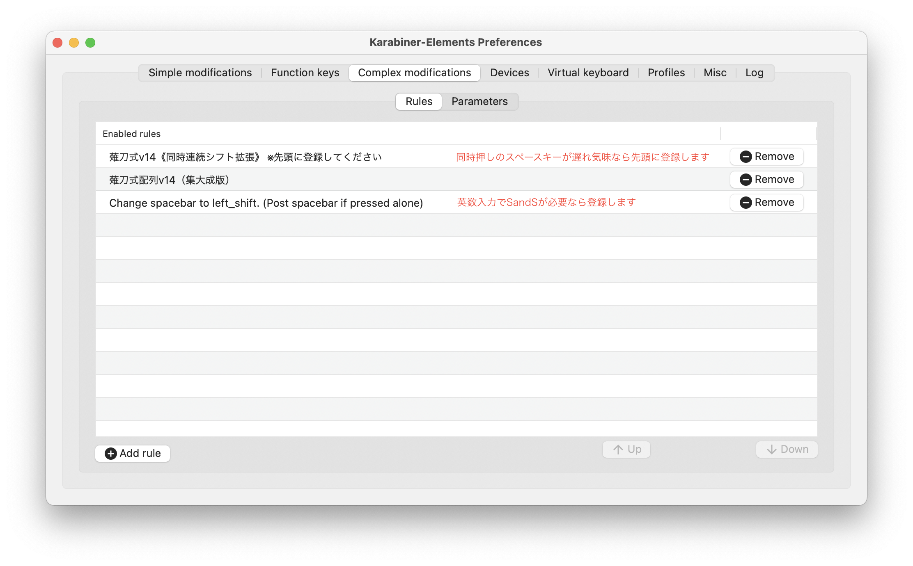
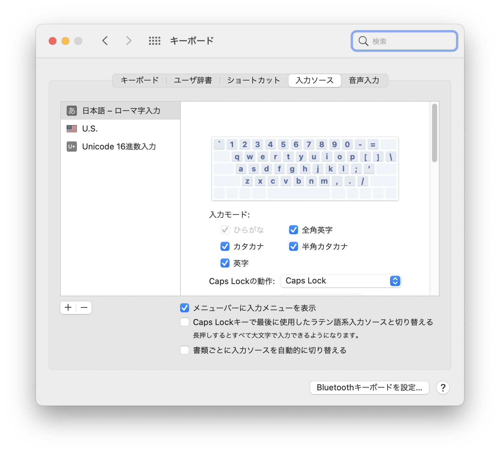
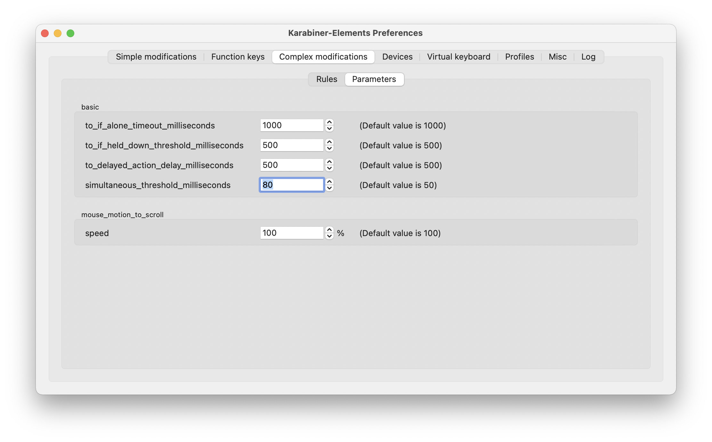

# Mac で薙刀式を使うスクリプト

### 薙刀式配列v14（集大成版） 2021年12月10日付

[【薙刀式】v14集大成版](http://oookaworks.seesaa.net/article/484704326.html#gsc.tab=0)

* docs/json/Naginata_v14-TypeB

ローマ字入力を使います。

Karabiner-Elements に登録してください。

通常シフトのみでよければ、"B: 薙刀式配列v14（集大成版）" だけを登録します。

そのほか、必要に応じて A1《同時連続シフト拡張》、A2《編集モード簡便化》、C1《左右シフトかな拡張》、C2《エンター同時押しシフト拡張》を登録します。

その場合、順序は上から A1、A2、B、C1、C2 としてください。

そして "キーボード"環境設定 で、英語の「U.S.」、その他の言語の「Unicode 16進数入力」を登録します。

同時押しの制限時間を好みに設定します。写真は 80ミリ秒 にした場合です。

後置シフトの時間は 60ミリ秒 に固定です。

## 特徴

* JISキーボードにもUSキーボードにも対応しています。
* 2キー同時押し、3キー同時押しは、同時押しの制限時間以内に押し切ってください。
* カーソル移動系のみリピートします。
* 左右シフトキーを押しながらで一時的に英字入力ができます。
《左右シフトかな拡張》を入れない場合。なお IM の設定にもよります。

## 動作確認(2022年4月初めの調べ)

* iMac (Retina 5K, 27-inch, Late 2015)

macOS Big Sur (11.6.1) + Karabiner-Elements (v14.3.0) + 日本語IM または かわせみ3 (3.0)

## 動作確認(現在)

* MacBook Pro (13-inch, M1, 2020)

Mac OS Monterey (12.3.1) + Karabiner-Elements (v14.4.0) + 日本語IM または かわせみ3 3.0.1(24) では、
文字確定からのカッコ脱出などの動作が完全に行えない不具合があることがわかっています。

# 不具合

* 変換確定前の文字がある時に編集モードの記号をともなう入力をすると、記号が前の方に入ることがある。

* A2《編集モード簡便化》の限界

編集モードを３つのキーを同時押ししなくても、「あい」「とか」「なん」「はこ」だけ同時押しし、もう一つのキーをゆっくり押しても発動します。

その代わり、「あい」「とか」「なん」「はこ」を含む語を入力するときには、いったんキーを離さなければなりません。

# 参考

* [【薙刀式】v14集大成版](http://oookaworks.seesaa.net/article/484704326.html#gsc.tab=0)
* [Karabiner-Elementsの設定項目をまとめました](https://qiita.com/s-show/items/a1fd228b04801477729c)
* [Documentation | Karabiner-Elements](https://karabiner-elements.pqrs.org/docs/)
* [Mac薙刀式v11 sorshi版](https://github.com/sorshi/KE-complex_modifications-NAGINATA)
* [Mac 記号や特殊文字のキーボードショートカットまとめ](http://inforati.jp/apple/mac-tips-techniques/system-hints/how-to-use-special-characters-and-symbols-keyboard-shortcut-with-macos.html)
* [Mac のキーボードショートカット](https://support.apple.com/ja-jp/HT201236)
* [Mac で日本語の英字とかなの文字対応を調べる](https://support.apple.com/ja-jp/guide/japanese-input-method/jpim10277/6.2.1/mac/10.14)
* [薙刀式v13 QMK版](https://github.com/eswai/qmk_firmware/tree/master/keyboards/crkbd/keymaps/naginata_v13u)

# 補足

[Mac薙刀式v11 sorshi版](https://github.com/sorshi/KE-complex_modifications-NAGINATA) を元にしました。

なお、スペースキーの定義以外の全てを jsonファイル直接編集で作成しています。

編集モード、濁点、半濁点、小書き文字の連続入力ができますが、これは [薙刀式v13 QMK版](https://github.com/eswai/qmk_firmware/tree/master/keyboards/crkbd/keymaps/naginata_v13u) の発想です。

「だが」「自動」「画像」「議事堂」「磁場」などの入力が楽になります。

ほか「ので」の入力を スペース押す→J押す→スペース離す→E押す で入力できるようにしました。
(「ま」「の」を押すと濁点フラグ"DA"がオンになります)
